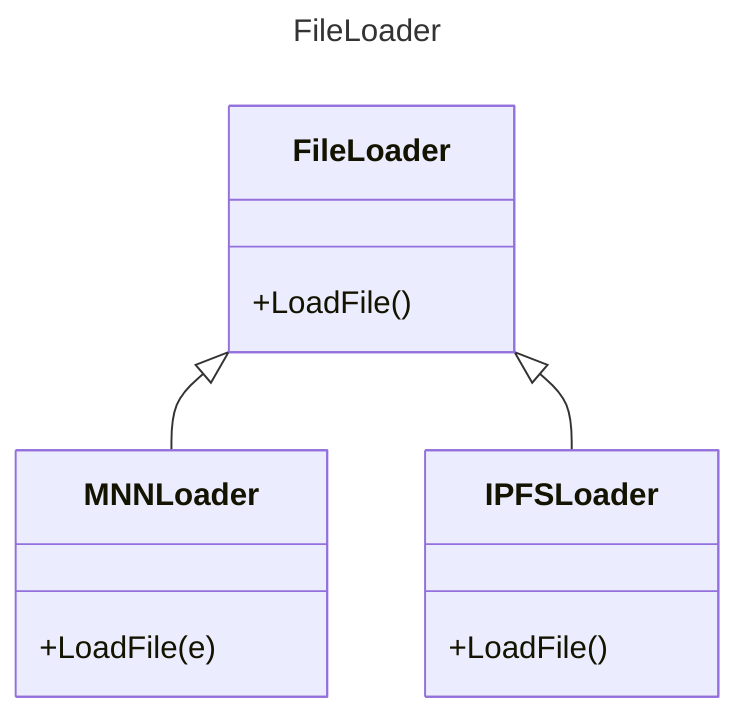
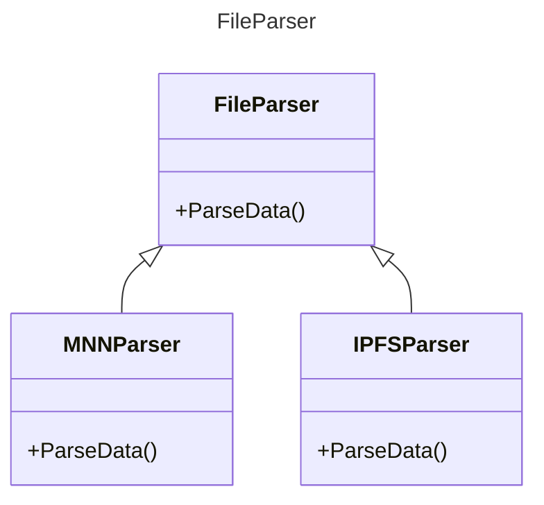
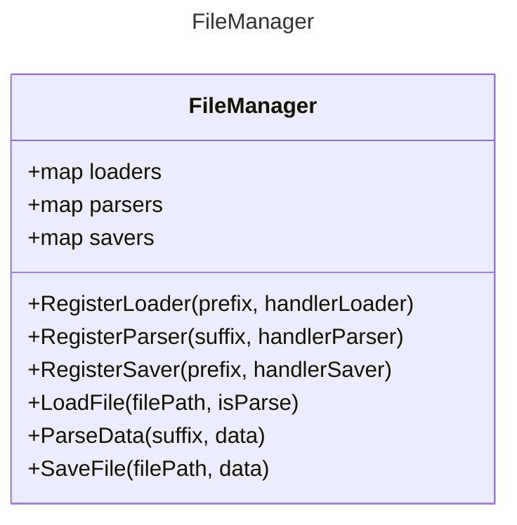

# FileLoader
Parsing and loading any format file support by Genuis Project
Current file format support
- MNN format
- **TODO**: Add more format file

## Design

Singleton pattern is apply for all Loader/Parser







## Depend on the library

- MNN: [https://github.com/alibaba/MNN](https://github.com/alibaba/MNN)
- Google Test: [https://github.com/google/googletest](https://github.com/google/googletest)

## Build with Linux

This is build a project alone.

```sh
$ mkdir .build
$ cd .build
$ cmake ..
$ make
Consolidate compiler generated dependencies of target fileloader
[ 57%] Built target MNN
[ 64%] Building CXX object CMakeFiles/fileloader.dir/src/MNNParser.cpp.o
[ 71%] Building CXX object CMakeFiles/fileloader.dir/src/MNNLoader.cpp.o
[ 85%] Built target fileloader
Consolidate compiler generated dependencies of target MNNExample
[ 92%] Building CXX object CMakeFiles/MNNExample.dir/MNNExample.cpp.o
[100%] Linking CXX executable MNNExample
[100%] Built target MNNExample
```

## Build with Windows
TODO: Need to update

## Build with Mac OS
TODO: Need to update

## Run the example
```bash
$ ./MNNExample 1.mnn 
LoadFile: DEBUG: filePath: file://1.mnn -prefix: file: -filename: 1.mnn -suffix: .mnn -filepathname: file://1.mnn
LoadFile Parse: DEBUG: filePath: file://1.mnn -prefix: file: -filename: 1.mnn -suffix: .mnn -filepathname: file://1.mnn
The device support i8sdot:0, support fp16:0, support i8mm: 0
        **Tensor shape**: 3, 320, 320, 
Error for compute convolution shape, inputCount:3, outputCount:24, KH:3, KW:3, group:1
inputChannel: 320, batch:3, width:320, height:320. Input data channel may be mismatch with filter channel count
Compute Shape Error for 967
        **Tensor shape**: 3, 320, 320, 
        **Tensor shape**: 1, 400, 80, 
        **Tensor shape**: 1, 100, 80, 
        **Tensor shape**: 1, 1600, 80, 
        **Tensor shape**: 1, 400, 4, 
        **Tensor shape**: 1, 100, 4, 
        **Tensor shape**: 1, 1600, 4, 
==================INPUT-DIMS================
Dimension Type: (CAFE/PyTorch/ONNX) uses NCHW as data format
==================OUTPUT-DIMS================
Output : cls_pred_stride_16
Output : cls_pred_stride_32
Output : cls_pred_stride_8
Output : dis_pred_stride_16
Output : dis_pred_stride_32
Output : dis_pred_stride_8
=============================================

`U
ParseFile: SaveFile: Saving File... -> Inside the IPFSSaver::SaveFile Function

```

## Future thinking
- Use [flatbuffer](https://github.com/google/flatbuffers) library to replace the raw buffer 